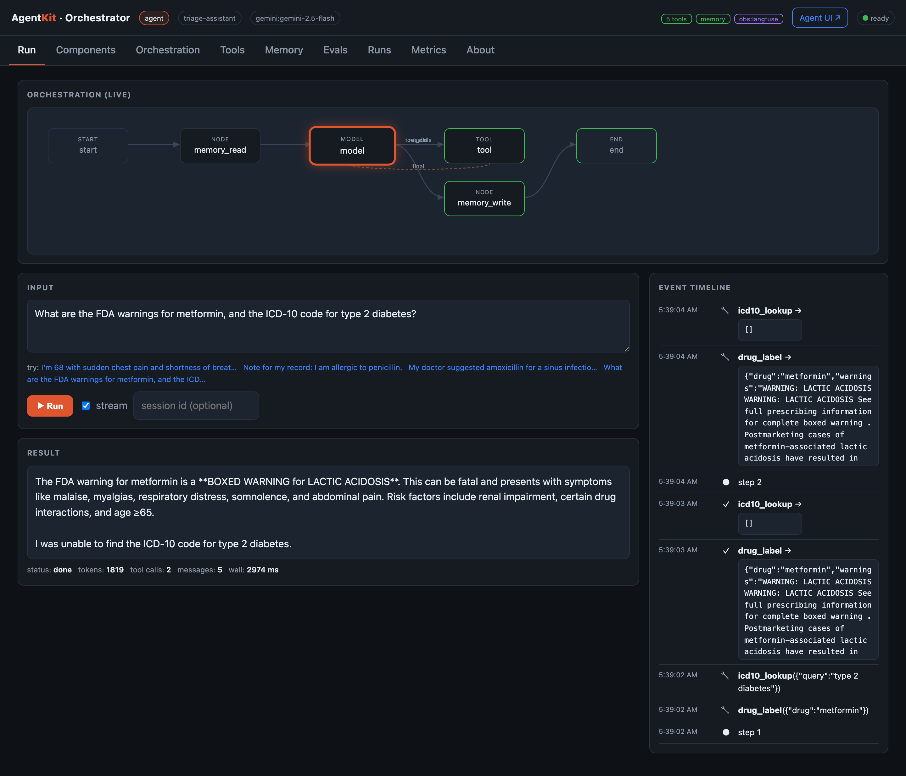
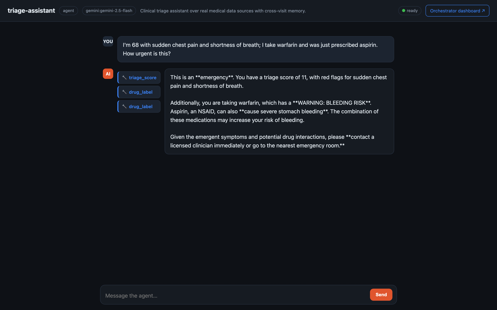
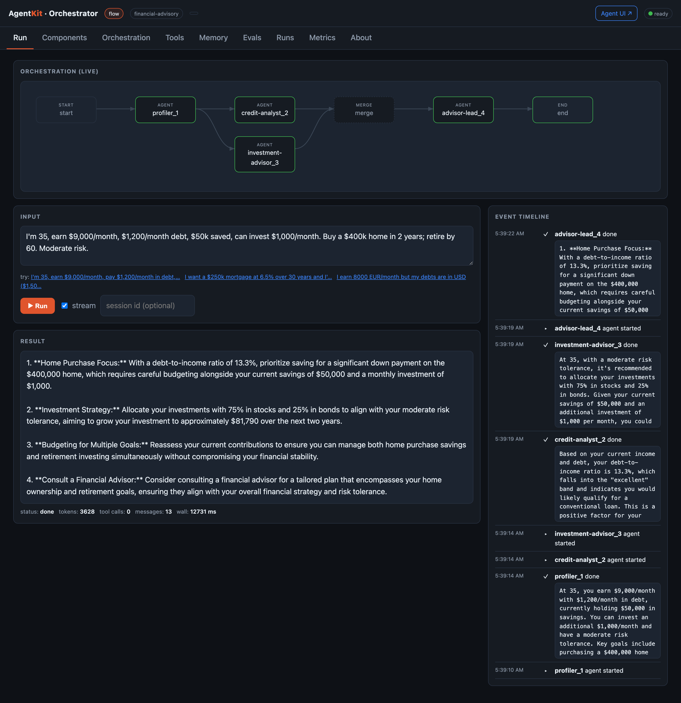
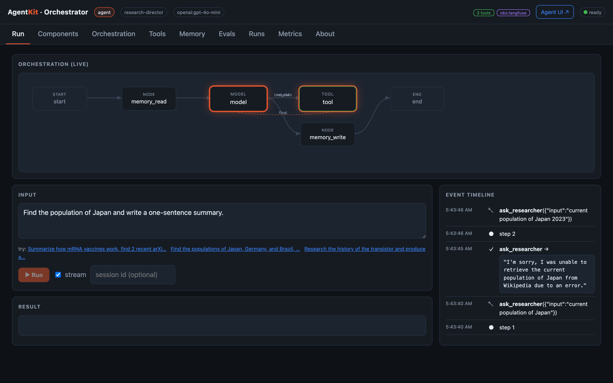
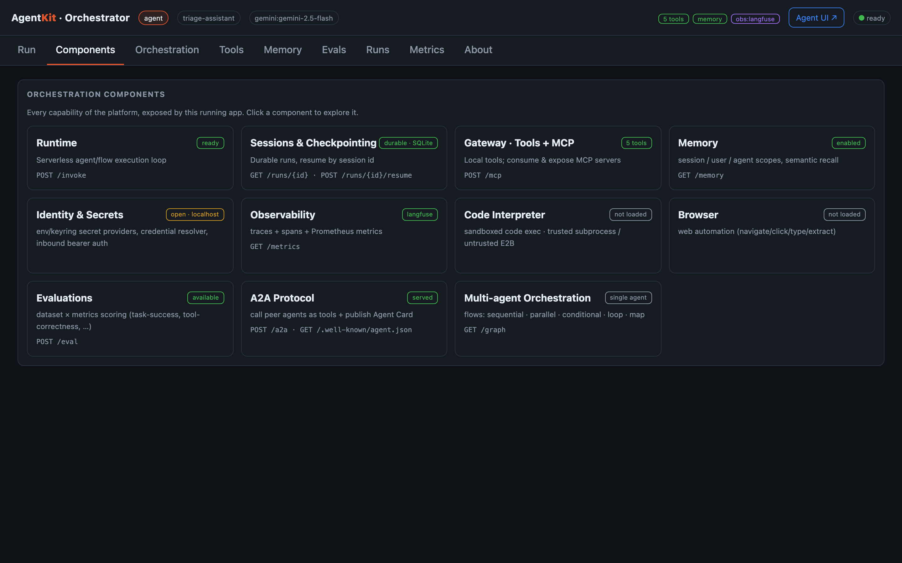
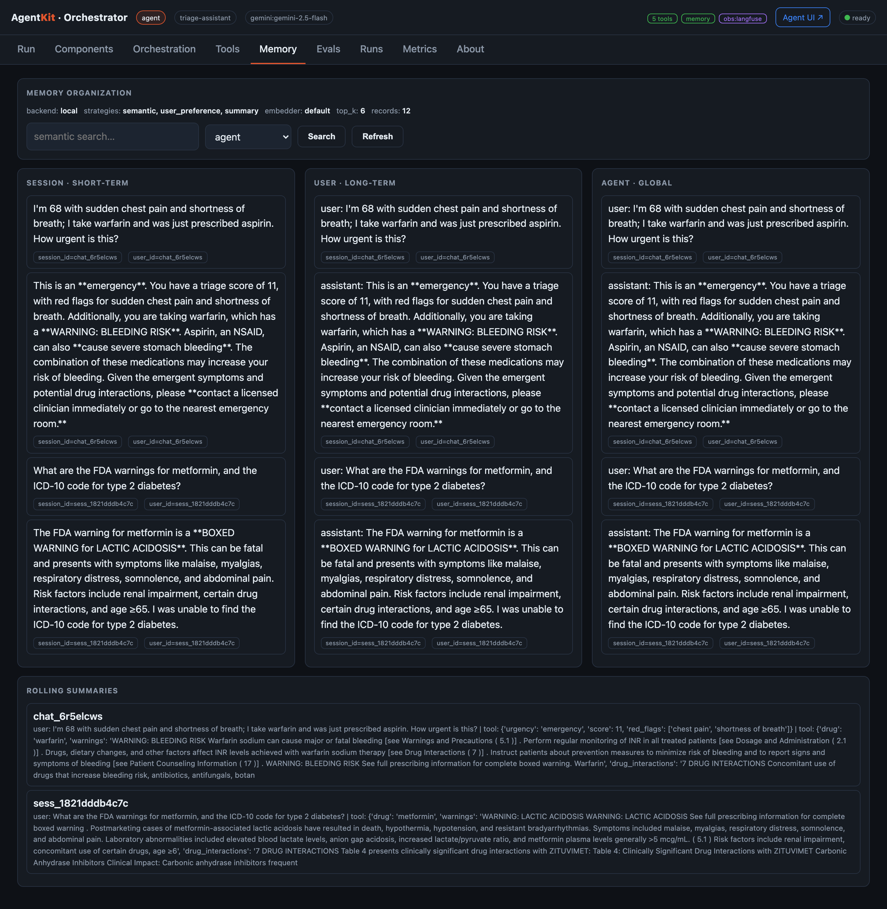
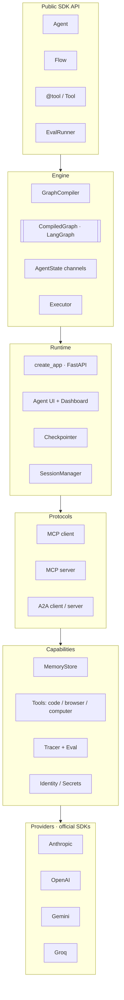
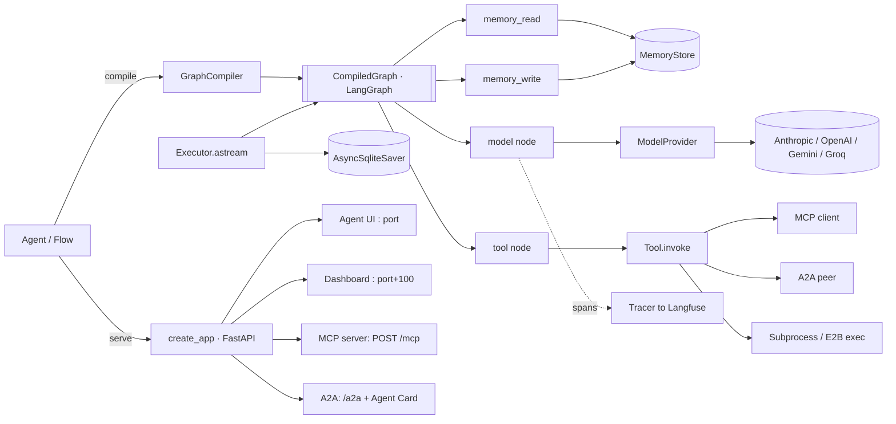
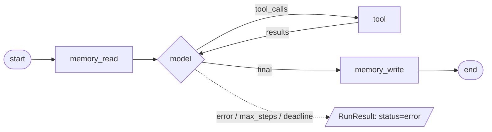
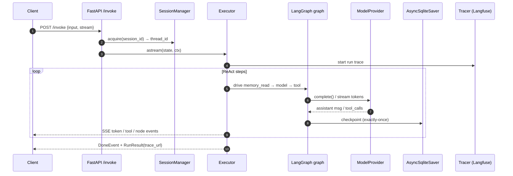

# AgentKit

**A library-first, VM-free agent harness & orchestration platform** — with a
built-in **Agent UI** and a separate **orchestrator dashboard**, MCP/A2A
protocols, scoped memory, sandboxed code execution, and one-line observability.

Define an agent in a few lines of Python. The *same object* runs in-process,
serves a **chat UI** for end users, exposes a **dynamic orchestration dashboard**
on a separate port, streams tokens, remembers across sessions, calls tools, speaks
**MCP** and **A2A**, runs code in a sandbox, and is traced (Langfuse) and
evaluated — no VMs, no separate orchestrator process. Providers are pluggable
(Anthropic, OpenAI, Gemini, Groq); heavy integrations are optional extras.

> **Install name:** `pip install agentkit-orchestrator` · **Import name:** `import agentkit`



```python
from agentkit import Agent, tool

@tool
def calculator(expression: str) -> float:
    "Evaluate a basic arithmetic expression."
    return float(eval(expression, {"__builtins__": {}}, {}))

agent = Agent(name="assistant", model="gemini:gemini-2.5-flash", tools=[calculator])

print(agent.run("What is 1234 * 5678?").output)   # in-process
agent.serve(port=8080, dashboard_port=8090)        # Agent UI :8080 · dashboard :8090
```

---

## Contents
- [Screenshots](#screenshots)
- [Setup](#setup)
- [Run the example apps](#run-the-example-apps)
- [Two UIs: Agent UI + Orchestrator dashboard](#two-uis-agent-ui--orchestrator-dashboard)
- [Architecture](#architecture)
- [Orchestration components](#orchestration-components)
- [How it's built](#how-its-built)
- [Configuration](#configuration)
- [Extending AgentKit](#extending-agentkit)
- [Testing](#testing)
- [Publishing to PyPI](#publishing-to-pypi)

---

## Screenshots

### Agent UI — the end-user chat surface (`:8811`)
A clean chat interface served on the agent's main port: streaming replies, inline
collapsible **tool-call chips**, session continuity, a trace link, and a button to
open the orchestrator dashboard. Below, the Healthcare agent reasons over **real
medical APIs** — it called `triage_score` and `drug_label` (openFDA), flagged the
warfarin+aspirin interaction, and scored the case an emergency.



### Dashboard · Run — the **orchestrator graph**, animated live (`:8911`)
The Run tab renders the agent/flow's **orchestration graph** (the ReAct
`model ⇄ tool` loop for agents, or the flow's parallel/conditional structure) and
**lights nodes up as the run executes**. Alongside is the full event timeline
(steps, tool calls with args/results, streamed tokens), the result, token usage,
and tool I/O. The graph comes from `GET /graph`, so it reflects **any** workflow.


### Dashboard · Multi-agent flow
A served `Flow` animates node-by-node. The Finance advisory desk runs
`profiler → (credit-analyst ‖ investment-advisor) → advisor-lead`, mixing Gemini
and OpenAI agents with live FX/crypto tools; each agent's output appears in the
timeline as it completes.



### Dashboard · Hierarchical / supervisory (subagents as tools)
A **supervisor** agent delegates to specialist subagents exposed via
`Agent.as_tool()`. The Research Desk's `research-director` calls
`ask_researcher` / `ask_analyst` / `ask_writer` (purple `agent`-source tool calls)
through its ReAct loop — the timeline shows each delegation. This is the doc's
"subagents are treated as tools" hierarchical pattern.



### Dashboard · Components — the capability map
Every orchestration component the running app exposes, with live status and the
endpoint behind it. Click any component to jump to its tab.



### Dashboard · Memory — every scope, granularly
Memory is captured at all three scopes and shown side-by-side: **session**
(short-term, the current turn), **user** (per-user long-term: facts + detected
preferences), and **agent** (global long-term), plus rolling session summaries and
live semantic search.



> The dashboard also has **Orchestration** (declared topology), **Tools**,
> **Evals** (run a dataset → metric scores), **Runs** (inspect/resume from
> checkpoint), and **Metrics** (Prometheus) tabs.

---

## Setup

### Requirements
- Python **3.11+**

### Install from PyPI

```bash
pip install "agentkit-orchestrator[gemini,openai,langfuse,yaml]"
```

Pick the extras you need: `anthropic`, `openai`, `gemini`, `groq` (providers),
`browser`, `sandbox`, `computer`, `memory`, `eval`, `langfuse`, `yaml`, or `all`.

### Install from source (for the example apps)

```bash
git clone https://github.com/ShaikNagurShareef/agentkit.git
cd agentkit
python3 -m venv .venv && source .venv/bin/activate
pip install -e '.[gemini,openai,langfuse,yaml]'
```

### Configure keys (`.env`)

Create a `.env` in the repo root (the examples load it automatically; it is
**git-ignored** — never commit keys):

```ini
GEMINI_API_KEY=your-gemini-key
OPENAI_API_KEY=your-openai-key

# optional model overrides (defaults shown)
GEMINI_MODEL=gemini-2.5-flash
OPENAI_MODEL=gpt-4o-mini

# optional — auto-enables Langfuse tracing + a "trace" link on every result
LANGFUSE_PUBLIC_KEY=pk-lf-...
LANGFUSE_SECRET_KEY=sk-lf-...
LANGFUSE_HOST=https://us.cloud.langfuse.com   # or LANGFUSE_BASE_URL
```

> Tip: use the live model discovery to pick a valid model id for your key:
> `python -c "import asyncio; from agentkit.models.base import resolve_provider as r; print([m.id for m in asyncio.run(r('gemini:x').list_models())][:10])"`

---

## Run the example apps

Each app serves the **Agent UI** on its port and the **dashboard** on `port+100`.
Tools call **real public APIs** (no extra keys). The launchers create the venv,
install deps, start the server, and open the Agent UI.

| Launcher | Agent UI · Dashboard | Pattern | Real data sources |
|---|---|---|---|
| `bash examples/start_healthcare.sh` | :8811 · :8911 | ReAct agent + cross-visit memory | NLM Clinical Tables (ICD-10/conditions), openFDA |
| `bash examples/start_finance.sh` | :8812 · :8912 | **Parallel** multi-agent flow `profiler → (credit ‖ investment) → synthesis` | Frankfurter FX, CoinGecko |
| `bash examples/start_research.sh` | :8813 · :8913 | ReAct agent + sandboxed **code interpreter** | Wikipedia, arXiv |
| `bash examples/start_interop.sh` | :8814 · :8914 | Orchestrator consuming an MCP gateway + A2A peer | — |
| `bash examples/start_supervisor.sh` | :8815 · :8915 | **Hierarchical/supervisory** — supervisor delegates to subagent-tools | Wikipedia, arXiv |
| `bash examples/start_patterns.sh` | :8816 · :8916 | **Evaluator-optimizer** — writer ↔ editor refinement | — |

### Multi-agent architecture patterns

AgentKit covers the patterns from Anthropic's *Building Effective AI Agents*:

| Pattern (from the doc) | AgentKit feature | Demonstrated by |
|---|---|---|
| **Single-agent / ReAct** | `Agent` (4-node graph, tool loop) | healthcare, research |
| **Sequential workflow** | `Flow().step().step()` | finance (profiler→…→synthesis) |
| **Parallel workflow** | `Flow().parallel(...)` (fan-out/fan-in) | finance (credit ‖ investment) |
| **Routing** | `Flow().when(pred).then().otherwise()` | healthcare triage flow / showcase |
| **Evaluator-optimizer** | `Flow` generate↔critique↔revise (or `.loop(until=…)`) | patterns app |
| **Hierarchical / supervisory** | `Agent.as_tool()` — subagents as tools | supervisor app |
| **Collaborative / peer-to-peer** | **A2A** peers called as tools (`a2a_peers`) | interop app |
| **Gateway / tool integration** | `@tool`, **MCP** consume/expose, code/browser | all apps / interop |

Hierarchical/supervisory in a few lines — subagents become tools:

```python
researcher = Agent(name="researcher", model="gemini:gemini-2.5-flash", tools=[wikipedia_search])
writer     = Agent(name="writer", model="openai:gpt-4o-mini")

supervisor = Agent(
    name="director", model="openai:gpt-4o-mini",
    instructions="Delegate: ask_researcher to gather facts, ask_writer to compose the answer.",
    tools=[researcher.as_tool(), writer.as_tool()],   # subagents as tools
)
supervisor.serve(port=8815, dashboard_port=8915)
```

Console demos (no UI): `examples/industry_agents.py`, `examples/showcase.py`,
`examples/protocols_demo.py`.

---

## Two UIs: Agent UI + Orchestrator dashboard

`agent.serve(port=8811, dashboard_port=8911)` (or `flow.serve(...)`) starts **two**
zero-dependency web UIs in one process, sharing the same agent + checkpoint DB,
cross-linked to each other:

- **Agent UI** (`:8811`) — the chat/product surface for end users.
- **Orchestrator dashboard** (`:8911`) — operator/dev introspection: dynamic
  execution trace, components, memory, evals, runs, metrics, traces.

Both expose the full JSON/SSE API, so the dashboard is just a client of the same
endpoints (no CORS):

| Method · Path | Purpose |
|---|---|
| `POST /invoke` | run (JSON or `text/event-stream` SSE when `stream:true`) |
| `GET /graph` · `GET /info` | declared topology · capabilities |
| `GET /memory` · `GET /memory/search` | memory snapshot · semantic search |
| `POST /eval` | run a dataset × metrics |
| `GET /runs/{id}` · `POST /runs/{id}/resume` | durable runs |
| `POST /mcp` · `GET /.well-known/agent.json` · `POST /a2a` | protocols |
| `GET /metrics` · `GET /healthz` | Prometheus · readiness |

---

## Architecture

Layered; each layer depends only on those below and is swappable behind a typed
(Pydantic v2) interface.



### Module map

| Package | Responsibility |
|---|---|
| `agentkit/agent.py` | `Agent` model, run loop, tool binding, `serve()`/`describe()` |
| `agentkit/flow.py` | `Flow` builder (step/parallel/when/loop/map), `FlowSpec`, node-streaming |
| `agentkit/engine/` | `AgentState` channels, `GraphCompiler` → LangGraph, `Executor` |
| `agentkit/runtime/` | FastAPI `create_app`, **Agent UI + dashboard**, `Checkpointer`, `SessionManager` |
| `agentkit/models/` | `ModelProvider` protocol + official-SDK providers, live `list_models()` |
| `agentkit/protocols/` | MCP client/server, A2A client/server, Agent Card |
| `agentkit/memory/` | `MemoryStore`, scopes, strategies, embedded vector store |
| `agentkit/observability/` | Tracer (no-op/console/Langfuse), spans, `EvalRunner` + metrics |
| `agentkit/tools/` | `@tool` + schema inference, code/browser/computer, registry |
| `agentkit/identity/` | Secret providers, `CredentialResolver`, inbound auth |
| `agentkit/spec.py`, `cli.py` | YAML agent/flow specs, `run/serve/eval/resume` CLI |

### Low-level data flow (`agent.serve(...)`)



### The agent run loop (ReAct over a compiled graph)



`memory_read` (scoped recall) → `model` (provider call, streaming) → `tool`
(execute + loop) → `memory_write` (extract to long-term memory). Termination: a
final answer, `max_steps`, or `deadline` — each a typed `RunResult`.

### Request lifecycle (served, with streaming)



---

## Orchestration components

| Component | Module | Endpoint(s) |
|---|---|---|
| **Runtime** | `runtime/app.py` | `POST /invoke` |
| **Sessions & Checkpointing** | `runtime/checkpoint.py` | `GET /runs/{id}`, `…/resume` |
| **Gateway (Tools + MCP)** | `tools/`, `protocols/mcp_*` | `POST /mcp` |
| **Memory** | `memory/` | `GET /memory` |
| **Identity & Secrets** | `identity/` | (middleware) |
| **Observability** | `observability/tracing.py` | `GET /metrics` + Langfuse |
| **Code Interpreter** | `tools/code.py` | (tool) — subprocess / E2B |
| **Browser** | `tools/browser.py` | (tool) |
| **Evaluations** | `observability/eval.py` | `POST /eval` |
| **A2A Protocol** | `protocols/a2a.py` | `POST /a2a`, `/.well-known/agent.json` |
| **Multi-agent Orchestration** | `flow.py` | `GET /graph` |

---

## How it's built

- **Engine = LangGraph behind a seam.** `GraphCompiler` builds a `StateGraph` over
  typed `AgentState` channels; the `CompiledGraph` interface lets the engine be
  swapped without touching agent code.
- **Providers via official SDKs**, each behind one `ModelProvider` protocol with a
  live `list_models()`. Model strings are `"<provider>:<model_id>"`; SDKs are lazy
  optional extras. True token streaming on all providers.
- **Durable, resumable runs**: the served app enters an `AsyncSqliteSaver` in its
  lifespan and compiles the graph against it; `/runs/{id}/resume` replays.
- **Streaming**: provider token deltas flow through a LangGraph custom stream
  writer; the runtime re-frames them (plus step/tool/node events) as SSE — which
  drive both the Agent UI and the dashboard's dynamic trace.
- **Memory**: embedded vector store with a zero-dependency hashing embedder;
  strategies populate long-term memory off the hot path. Swap in Qdrant/Chroma.
- **Observability**: implicit span instrumentation; no-op by default, Langfuse when
  keys are present (auto-detected), deep-linking `RunResult.trace_url`.
- **Trust boundaries**: code runs in a resource-limited subprocess (trusted) or an
  E2B sandbox (untrusted, fail-closed).

Built from the `AgentKit-Design.pdf` low-level spec (milestones M1–M7). **68 tests**
cover the engine loop, tools, errors, checkpointing, serving (SSE/durability/auth),
MCP+A2A, memory, eval, flows, providers, the CLI, and the UI split.

---

## Configuration

| Env var | Default | Purpose |
|---|---|---|
| `<PROVIDER>_API_KEY` | — | model keys (`GEMINI_API_KEY`, `OPENAI_API_KEY`, …) |
| `AGENTKIT_DB_URL` | `sqlite:///./agentkit.db` | checkpointer DSN |
| `AGENTKIT_MAX_CONCURRENT` | `64` | concurrent-run ceiling |
| `AGENTKIT_OBS` | `langfuse` | tracer backend (`langfuse`/`console`/`none`) |
| `LANGFUSE_PUBLIC_KEY` / `_SECRET_KEY` / `_HOST` | — | auto-enables Langfuse |
| `AGENTKIT_AUTH_TOKEN` | — | require `Authorization: Bearer` on non-health routes |

---

## Extending AgentKit

| Extend | Mechanism |
|---|---|
| New tool | `@tool` function, or a package exposing the `agentkit.tools` entry point |
| New model provider | implement `ModelProvider`, register in `models/base.py` |
| New memory store | implement `MemoryStore`, register `agentkit.backends` |
| New checkpointer | implement `Checkpointer`, register `agentkit.backends` |
| New tracer | implement the `Tracer` protocol (Langfuse default, OTel alt) |
| Engine backend | swap LangGraph behind the `CompiledGraph` interface |

---

## Testing

```bash
pip install -e '.[dev]'
pytest                       # 68 tests, no API key required (scripted FakeModelProvider)
```

CLI:

```bash
agentkit run   examples.app_finance:flow --input "..."   # or a .yaml spec
agentkit serve examples.app_healthcare:agent --port 8811
agentkit eval  <target> --dataset items.json --metrics task_success,tool_correctness
agentkit resume <target> <session_id>
```

---

## Publishing to PyPI

The package builds to a wheel + sdist (the Agent UI / dashboard HTML are bundled):

```bash
pip install build twine
python -m build                       # → dist/*.whl and *.tar.gz
twine check dist/*                    # both should PASS
twine upload --repository testpypi dist/*    # test first
twine upload dist/*                   # publish (needs a PyPI token)
```

The distribution name is `agentkit-orchestrator` (the import package is
`agentkit`). Change `name` in `pyproject.toml` if you fork/republish.

---

## License

MIT — see [LICENSE](LICENSE).
